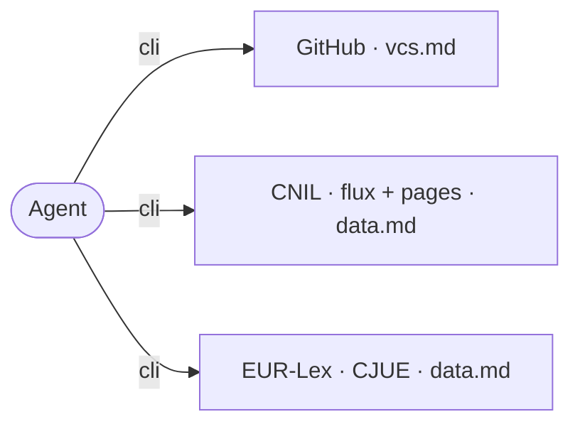

# Ecosystem

```mermaid
flowchart LR
  Agent([Agent])
  Vcs["GitHub · vcs.md"]
  Cnil["CNIL · flux + pages · data.md"]
  Cjeu["EUR-Lex · CJUE · data.md"]

  Agent -- cli --> Vcs
  Agent -- cli --> Cnil
  Agent -- cli --> Cjeu
```
