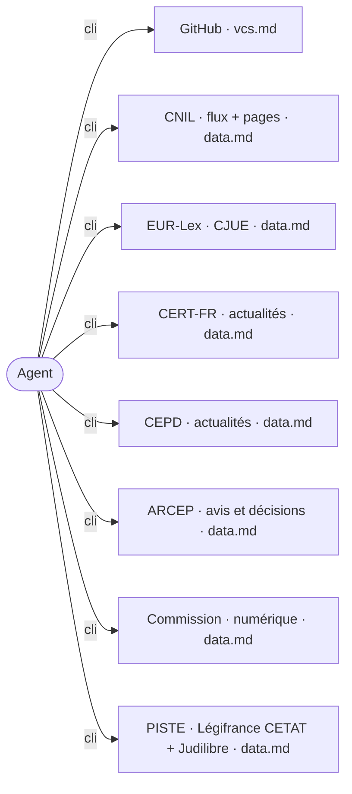

# Ecosystem

```mermaid
flowchart LR
  Agent([Agent])
  Vcs["GitHub · vcs.md"]
  Cnil["CNIL · flux + pages · data.md"]
  Cjeu["EUR-Lex · CJUE · data.md"]
  Anssi["CERT-FR · actualités · data.md"]
  Cepd["CEPD · actualités · data.md"]
  Arcep["ARCEP · avis et décisions · data.md"]
  Commission["Commission · numérique · data.md"]
  Piste["PISTE · Légifrance CETAT + Judilibre · data.md"]

  Agent -- cli --> Vcs
  Agent -- cli --> Cnil
  Agent -- cli --> Cjeu
  Agent -- cli --> Anssi
  Agent -- cli --> Cepd
  Agent -- cli --> Arcep
  Agent -- cli --> Commission
  Agent -- cli --> Piste
```
